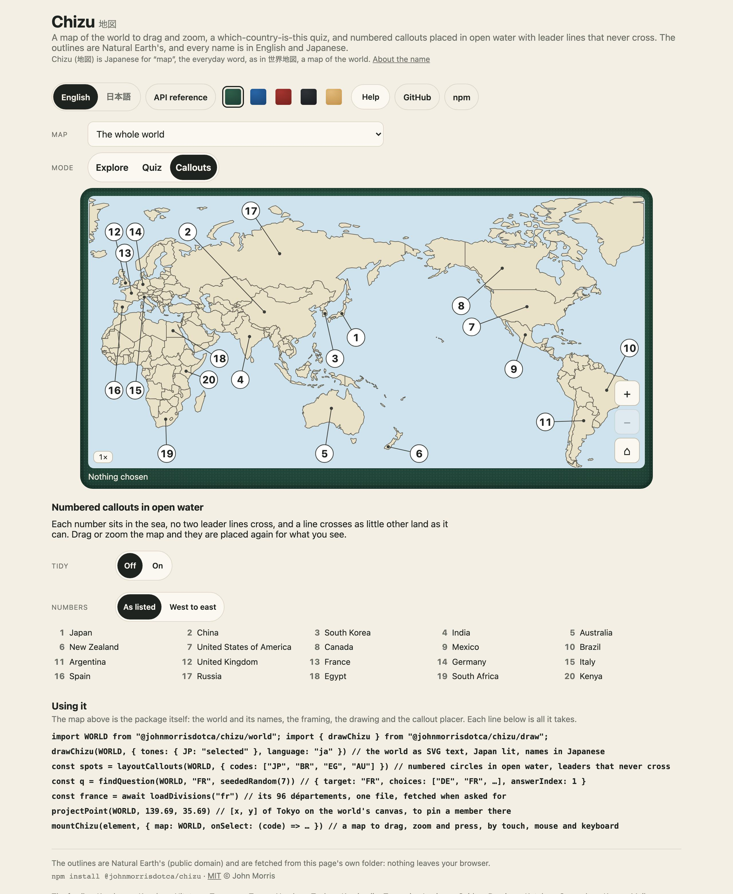
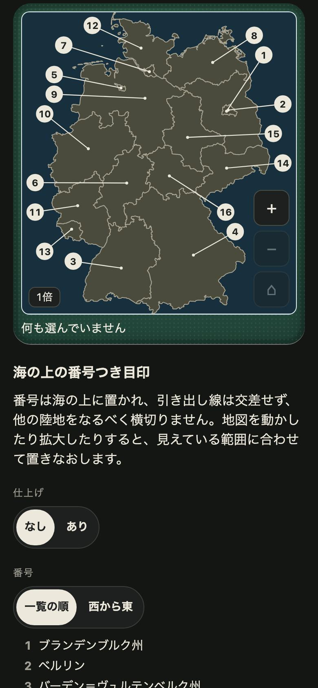

<h1 align="center">Chizu <sub>地図</sub></h1>

<p align="center"><strong>Maps for JavaScript and TypeScript, in English and Japanese.</strong><br>
The world and 31 countries' regions drawn from Natural Earth (public domain), every country named in English and Japanese, and the engine around them: framing and zoom, insets, a world that wraps round the date line, quiz distractors, and a callout placer that puts numbered circles in open water with leader lines that never cross. Drawn as SVG text, or dragged and zoomed in any page, as one call. No dependencies.</p>

<p align="center">
  <a href="https://github.com/johnmorrisdotca/chizu/actions/workflows/ci.yml"></a>
  <a href="https://www.npmjs.com/package/@johnmorrisdotca/chizu"></a>
  <a href="./LICENSE"></a>
  
</p>

<p align="center"><a href="https://johnmorrisdotca.github.io/chizu/"><strong>Open the map →</strong></a> · <a href="https://johnmorrisdotca.github.io/chizu/api.html">API reference</a></p>

<p align="center">
  
  
</p>

Chizu is a map and the things a person does with one: look for a country, say which country a shape is, put a number on each of twenty places so a printed sheet can name them. It was made for the geography quizzes and study sheets of [Itsutsu](https://itsutsu.com), and for a Japanese study app by the same author, and taken out of both so that each can import it. It runs in [the demo](https://johnmorrisdotca.github.io/chizu/), with nothing to install.

## In 30 seconds

```sh
npm install @johnmorrisdotca/chizu
```

```ts
import WORLD from "@johnmorrisdotca/chizu/world";
import { drawChizu } from "@johnmorrisdotca/chizu/draw";
import { findQuestion, layoutCallouts, seededRandom } from "@johnmorrisdotca/chizu";

drawChizu(WORLD, { tones: { JP: "selected" }, language: "ja" });   // the world as SVG text, Japan lit, names in Japanese

findQuestion(WORLD, "FR", seededRandom(7));
// { target: "FR", choices: ["BE", "FR", "DE", "CH"], answerIndex: 1 }: France among its look-alikes, the same every time

layoutCallouts(WORLD, { codes: ["JP", "BR", "EG", "AU"], radiusRatio: 0.02 });
// [{ code: "JP", number: 1, start: [455.6, 211], circle: [476.6, 268.1], radius: 20 }, …]
```

And in a page, a map to drag, zoom and press, by touch, mouse and keyboard:

```ts
import WORLD from "@johnmorrisdotca/chizu/world";
import { mountChizu } from "@johnmorrisdotca/chizu/mount";

mountChizu(document.getElementById("map")!, { map: WORLD, onSelect: (code) => console.log(code) });
```

## Who it is for

- **Geography quiz and study sites** that want "which country is this?" with look-alike wrong answers built in (neighbours first, then the same continent, then whatever is nearest), questions that come out the same from the same seed, and names in English and Japanese.
- **Printable sheets and worksheets**, where a map has to be labelled with numbers that sit in the sea, never on the land, with leader lines that do not cross each other and cross as little other land as they can.
- **A site that pins things on a map**: members' home countries, battles, photographs. `projectPoint` puts a longitude and latitude on the world's canvas, and the world pans round without stopping.
- **Anyone who needs country outlines and names in Japanese** and wants them as plain data, rebuilt from a public-domain source by a script they can read, with the source and its version written beside them.

## Use it in your project

Chizu is five things, each usable without the others: **the engine** (framing, zoom, insets, callouts, distractors, pasted names; plain functions over plain data), **the maps** (the world, a country alone, a country's regions: data, one file each), **the drawing** (SVG text), **the page** (a mounted map) and **the names** (every country in both languages, with no outlines). The table under [API](#api) says which entry holds which.

### 1. The engine alone, on a server

```ts
import { layoutCallouts, regionBox, zoomBox, zoomToFit } from "@johnmorrisdotca/chizu";
import { loadDivisions } from "@johnmorrisdotca/chizu/load";

const germany = (await loadDivisions("de"))!;               // 16 states, one file, fetched when asked for
regionBox(germany, "BY", 1.5);                              // a window tight on Bavaria, in a frame 1.5 times as wide as tall
zoomToFit(germany, ["BY", "BW"]);                           // { zoom: 1, centre: { x: 518.8, y: 868.2 } }
layoutCallouts(germany, { codes: germany.regions.map((r) => r.code) });   // sixteen numbered circles for a sheet
```

Every function takes a map and returns new values; none changes what it was given, and none needs a browser.

### 2. One map in a page

```ts
import { mountChizu } from "@johnmorrisdotca/chizu/mount";
import { loadCountry } from "@johnmorrisdotca/chizu/load";

const map = await loadCountry("jp");                        // Japan alone, from 1:50m outlines
const mount = mountChizu(element, { map: map!, language: "ja" });
mount.zoomBy(1);
```

### 3. A bundler, and a framework

Each country's map is its own file and its own dynamic import (`@johnmorrisdotca/chizu/load` holds one `import()` for each), so a bundler makes a chunk of every one and a page fetches only the one it draws. The world is 170 kB (61 kB gzipped). A map is a plain object with no functions in it, so it serialises, caches and crosses a worker boundary as it is.

### What a developer gets

- **Plain data.** A `ChizuMap` is `{ id, kind, name, nameJa, width, height, wraps, projection, insets, regions }`, and a region is `{ code, name, nameJa, reading, group, path, bbox, centroid, neighbors }`. Your own map (a floor plan, a game board) is the same shape, and everything in the engine works on it.
- **The look comes from custom properties.** The drawing and the mounted map are coloured by `--cz-*` and `--czm-*` properties, light and dark, and nothing is branded.
- **TypeScript types for all of it.** Every export has a doc comment, so an editor shows it as you type.

## Features

- **The world, and 238 countries each on its own.** One canvas for the world, Miller's projection centred on 155°E (so Japan and the whole Pacific are in the middle, the way a Japanese classroom's wall map is drawn). Each country alone is a map of its own, from the 1:50m outlines, and from the 1:10m ones for the small ones, so that Singapore and Malta are shapes and not hexagons.
- **31 countries' regions**, each its own file: the states of the United States, Germany and Brazil, the provinces of Canada, the départements of France, the counties of Ireland, and on to Vietnam. Names in Japanese for nearly every one.
- **Names in English and Japanese for every country**, with the everyday short name (アメリカ for アメリカ合衆国) and the reading in kana. The table of them is its own entry, 38 kB, with no outlines.
- **Framing and zoom in five steps**, a window on a region, one tight on a shape, a square for an icon, and a fit for a group of regions. A region drawn in a box (Alaska and Hawaii) is framed where it is *drawn*, not out in the Pacific.
- **A world that goes round.** East and west never stop on the world: the canvas is drawn again either side of itself wherever the window overhangs.
- **A callout placer.** Numbered circles in the water between and around the regions, no two leaders crossing, each crossing as little land as it can, with a slower pass for a printed sheet. The same arrangement every time.
- **Quiz distractors.** The wrong answers for "which one is this?", tempting for a reason, the same for the same seed.
- **Pasted names to places.** A list somebody typed (English, Japanese, short names, readings) becomes the regions it names, in the order written, with what matched nothing said back.
- **Longitude and latitude to the canvas, and back**, for the world and for each country alone, held to d3-geo's own to a hundredth of a unit.
- **Drawn as SVG text** in an entry of its own, with tones for right and wrong, labels, insets in dashed frames and numbered callouts, for a server, an email, a build step or `innerHTML`.
- **Dragged and zoomed in any page**: drag to move, buttons, Ctrl and the wheel or a pinch to zoom, arrow keys, a press to choose; with the words in English and Japanese for a screen reader.
- **No dependencies**, no network requests, and nothing stored outside the page it is in.

## Maps

| Map | Entry | What it is | Size |
| --- | --- | --- | --- |
| The world | `@johnmorrisdotca/chizu/world` | 173 countries, Natural Earth at 1:110m | 170 kB |
| A country alone | `@johnmorrisdotca/chizu/countries/<code>` or `loadCountry("<code>")` | 238 countries and territories at 1:50m (1:10m under 60,000 km²), on a canvas of their own whose longer side is 1,000 | 16 kB for Japan, 157 kB for Canada |
| A country's regions | `@johnmorrisdotca/chizu/divisions/<code>` or `loadDivisions("<code>")` | 31 countries, Natural Earth admin-1 at 1:10m | 203 kB for Germany, 1.8 MB for Russia |

The codes are ISO 3166-1 alpha-2, in lower case in a file's name (`fr`), and Natural Earth's own three letters for the few places that have none. `CHIZU_COUNTRIES` (from `@johnmorrisdotca/chizu/names`) lists every country with its names, and says which have a map of their own regions.

The **31 countries with regions** are Argentina, Australia, Austria, Belgium, Brazil, Canada, Chile, China, Colombia, France, Germany, Ireland, Italy, Malaysia, Mexico, the Netherlands, New Zealand, Norway, Peru, the Philippines, Poland, Russia, South Korea, Spain, Sweden, Switzerland, Taiwan, Thailand, the United Kingdom, the United States and Vietnam.

**What a country alone leaves out.** A country is drawn with its largest piece and every piece within 9° of it, so France is the mainland and Corsica, not French Guiana, Réunion and the Pacific (they are on the world map). The United States is the lower forty-eight and Alaska.

**The world leaves out** Antarctica, the French Southern Lands, Northern Cyprus and Somaliland, and at 1:110m the smallest countries are left off it: 173 are drawn, and every one of the 238 is in its own file.

### The canvas and the codes

A map's canvas is `0 0 width height`, `viewBox` says so, and a region's `path` is `M x,y L x,y … Z` with one piece for each part (an island is a piece), to two decimals. A region's `code` is its ISO 3166-1 alpha-2 code on the world, and on a country's regions the code Natural Earth gives (a postal code, the ISO 3166-2 part, or a number). `neighbors` lists the regions that share a border point with it. `group` is the continent on the world and the larger part of the country on a map of regions, and is what quiz distractors use.

## Framing a map

A window is a `MapBox`, `{ x, y, width, height }` in the map's units, which is what an SVG `viewBox` says (`boxToViewBox`).

```ts
import { focusBox, regionBox, shapeGlyphBox, zoomBox, zoomToFit, MAP_ZOOM_LEVELS } from "@johnmorrisdotca/chizu";

zoomBox(map, 3, { x: 500, y: 300 });          // the window three times in, about that point, kept on the map
zoomBox(WORLD, 3, { x: 1200, y: 244 });       // on the world it is not kept east and west: it goes round
focusBox(map, ["BY", "BW"]);                  // a window that frames these regions with room round them
regionBox(map, "BY", 2.5);                    // tight on one shape, in a frame 2.5 times as wide as tall
shapeGlyphBox(region.bbox);                   // a square every shape fills, for an icon
zoomToFit(map, ["NY", "PA", "NJ"]);           // { zoom, centre }: the closest step that holds them all
MAP_ZOOM_LEVELS;                              // [1, 2, 3, 4, 5]
```

**Insets.** A map's `insets` list the regions it draws in a box of its own, with the box. Alaska and Hawaii are in two boxes under the lower forty-eight on the United States' map, and an inset may hold only a region's outlying islands (`outlyingBelow`) and magnify them (`magnify`). Everything that frames, outlines or numbers a map reads the list, so a region is found where it is drawn.

**The world goes round.** `wrapOffsets(box, width)` says how many copies of the canvas a window sees, `wrapIntoBox` finds the copy of a point that is on screen, and `nearestWrappedBox` slides a destination onto the nearest copy so that travelling from Japan to Hawaii is a short hop east.

## Numbered callouts

`layoutCallouts(map, request)` puts a numbered circle for each region asked for in the open space between and around the land, and gives back where each leader starts and where its circle sits:

```ts
const spots = layoutCallouts(map, {
  codes: ["BY", "NW", "SL"],   // the regions, numbered in this order
  box,                         // the window the map is drawn in; default the whole map
  radiusRatio: 0.03,           // the circle's radius as a share of the window's width
  polish: true,                // finish with the slow pass for a printed sheet
  keepOut: { bottom: 200, right: 40 },   // a corner to keep clear, for a credit line
  numbering: "west-to-east",   // or "given", the default
});
// [{ code: "BY", number: 1, start: [x, y], circle: [x, y], radius }, …]
```

Three things are weighed, in this order: a circle sits in water; no two leaders cross; a leader crosses as little land as it can. A circle goes to the nearest place it fits (the sea off its own coast, the gap between two islands, the empty half of the frame) and not to one of four sides. The numbers are checked against the coastline itself and not the box round it, so an inland sea or a bay is room. Where a frame has less room than it has circles, they close up rather than some going undrawn. A start is a point on the region's own land, not its centre, which for a chain or a crescent is in the sea.

`polish: true` adds an annealing pass that leaves no two leaders closer than a circle's radius and none through another number, and lets a leader leave its region from the coast nearest its number. It takes a few seconds on a crowded sheet and is seeded, so the same sheet is drawn the same every time.

`placeCallouts`, `calloutSpaces` and `calloutFaults` are the lower levels: the placement over any list of centroids and rings, the places a circle may sit, and the count of crossings and near-misses a sheet is held to.

## Which one is this?

```ts
import { findQuestion, pickDistractors, seededRandom } from "@johnmorrisdotca/chizu";

pickDistractors(WORLD, "DE", { count: 3 });    // ["LU", "NL", "AT"]: its neighbours first
pickDistractors(WORLD, "JP", { count: 3 });    // ["KP", "KR", "TW"]: nothing touches Japan, so whatever is nearest
findQuestion(WORLD, "FR", seededRandom(7));    // the target and its choices in an order the seed fixes
```

A wrong answer is scored 100 for a land neighbour, 60 for sharing a group and up to 40 for being close (`distractorScore`), so the choices are places a person could take it for. With a `random` stream the best few are shuffled and cut so the same country is not asked with the same company every time; without one the answer is simply the best `count`. `among` limits the places that may be offered.

## Pasted names

```ts
import { placesFromText } from "@johnmorrisdotca/chizu";

placesFromText("Japan, フランス\nBrazil, Narnia", WORLD.regions);
// { codes: ["JP", "FR", "BR"], missing: ["Narnia"] }
```

Case and surrounding space never matter, a name may be English, Japanese, the short Japanese or the reading, and a line that matches nothing is said back and never guessed at: "Tokyo" does not quietly become Tochigi. `optionalEnding` lets a pasted prefecture leave off its 県 or 府 (`/[県府都道]$/u`). `countriesFromText` does the same over the table of every country.

## Longitude and latitude

```ts
import { projectPoint, unprojectPoint } from "@johnmorrisdotca/chizu";

projectPoint(WORLD, 139.69, 35.69);    // [457.5, 212.5]: Tokyo on the world's canvas
unprojectPoint(WORLD, 456, 200);       // [139.2, 39.6]
```

A map keeps how its canvas was made (`projection`). Two are closed formulas, done here with no dependency: Miller's cylindrical round a centre longitude (the world) and Lambert azimuthal equal-area round a centre (a country alone). A country's regions were fitted with a projection of their own, and `projectPoint` answers `null` for them, never a guess. The tests hold both formulas to d3-geo's own.

## Drawing a map

```ts
import { drawChizu } from "@johnmorrisdotca/chizu/draw";

drawChizu(map, {
  box,                                      // a window; default the whole map
  language: "ja",                           // names for a screen reader and the labels
  tones: { BY: "selected", NW: "correct" }, // selected, correct, wrong, hint, muted, faint, or any name x for the class cz-tone-x
  callouts: ["BY", "NW", "SL"],             // or a full request, as layoutCallouts takes it
  labels: true,                             // names on the land, where they fit; or a list of codes
  interactive: true,                        // every region a thing to press
  style: true,                              // carry CHIZU_STYLE inside, so the drawing stands alone as an image
});
```

It is a string, so it works on a server, in a build step, in an email or in `innerHTML`. Each region is a `<g class="cz-region" data-code="…">` with a `<title>` and a `<path class="cz-land">` for each piece, and a window that overhangs the world's seam draws the land again on the far side.

## Playing with a map in a page

```ts
import { mountChizu } from "@johnmorrisdotca/chizu/mount";

const mount = mountChizu(element, { map, language: "ja", onSelect: (code) => …, onView: (view) => … });
mount.select("BY");   // choose a region and zoom to it
mount.show(["BY", "BW"]);   // look at these
mount.set({ tones: { BY: "correct" }, callouts: ["BY", "NW"] });
mount.setMap(otherMap);
mount.zoomBy(1);
mount.reset();
mount.destroy();
```

| Input | What it does |
| --- | --- |
| Drag | moves the map; a drag past the edge stops at it (not on the world, which goes round) |
| The `+`, `−` and `⌂` buttons | zoom in and out in five steps, and back to the whole map |
| Ctrl or ⌘ and the wheel, or a pinch | zoom a step about the pointer. The wheel alone scrolls the page |
| A press | chooses a region (and a second press on it, none) |
| Arrow keys, `+`, `-`, `0` | move, zoom, and show the whole map, with the map focused |

`selectable: false` makes the map only looked at, which a quiz wants. Callouts are placed again for the window as it is after each move, and keep out from under the buttons.

## API

The [API reference](https://johnmorrisdotca.github.io/chizu/api.html) lists every export of every entry point with its signature and its doc comment. It is made from the source by `pnpm site`, so it cannot fall behind the code.

| Entry | What it holds |
| --- | --- |
| `@johnmorrisdotca/chizu` | The engine: `wholeMapBox`, `zoomBox`, `focusBox`, `regionBox`, `zoomToFit`, `shapeGlyphBox`, `MAP_ZOOM_LEVELS`; `insetFor`, `insetTransform`; `wrapOffsets`, `wrapIntoBox`; `mapOutlines`, `parseMapRings`, `landAnchor`, `pointInRing`; `layoutCallouts`, `placeCallouts`, `calloutFaults`; `findQuestion`, `pickDistractors`, `distractorScore`; `placesFromText`; `projectPoint`, `unprojectPoint`; `nameOf`, `chizuSay`, `CHIZU_STRINGS`; `seededRandom`, `shuffled`; `VERSION` |
| `@johnmorrisdotca/chizu/draw` | `drawChizu`, `CHIZU_STYLE` |
| `@johnmorrisdotca/chizu/mount` | `mountChizu`, `ensureChizuMapStyle`, `CHIZU_MAP_STYLE` |
| `@johnmorrisdotca/chizu/names` | `CHIZU_COUNTRIES`, `CHIZU_SOURCE`, `countryByCode`, `countriesFromText` |
| `@johnmorrisdotca/chizu/load` | `loadCountry`, `loadDivisions`, `COUNTRY_CODES`, `DIVISIONS_CODES` |
| `@johnmorrisdotca/chizu/world` | the world, as the default export and as `WORLD` |
| `@johnmorrisdotca/chizu/countries/<code>` | one country alone, as the default export |
| `@johnmorrisdotca/chizu/divisions/<code>` | one country's regions, as the default export |

Every function is pure: it returns new values and never changes what it was given.

## Theming

Nothing here is branded. The drawing and the mounted map are coloured by custom properties, and a page sets only the ones it wants different. They follow the device's light or dark setting; `data-theme="light"` or `"dark"` on `<html>` forces one.

**The drawing** (`drawChizu`), custom properties on `.chizu`:

| Property | What it colours | Light | Dark |
| --- | --- | --- | --- |
| `--cz-sea` | the sea | `#cfe3ee` | `#18303d` |
| `--cz-land` | land | `#e9e1c8` | `#4a4a3d` |
| `--cz-line` | a border | `#5d5a50` | `#aaa592` |
| `--cz-inset` | the dashed frame of an inset | `#7a766a` | `#8f8b7a` |
| `--cz-ink` | a printed name | `#1f2320` | `#ece8dc` |
| `--cz-selected` | the tone `selected` | `#ffd23f` | `#a8841a` |
| `--cz-correct` | the tone `correct` | `#9bd6a8` | `#2f6b45` |
| `--cz-wrong` | the tone `wrong` | `#f0a99b` | `#8a3a2c` |
| `--cz-hint` | the tone `hint` | `#b7dcf4` | `#2d5a78` |
| `--cz-muted` | the tone `muted` | `#d9d5c6` | `#3a3a30` |
| `--cz-faint` | the tone `faint` | `#f3efe4` | `#55554a` |
| `--cz-callout` | a callout's circle | `#ffffff` | `#ece8dc` |
| `--cz-callout-ink` | a callout's number | `#1f2320` | the same |
| `--cz-leader` | a leader line and its dot | `#3a3d38` | `#ece8dc` |
| `--cz-halo` | the halo round a printed name | `#f7f3e8` | `#1d201e` |
| `--cz-font` | the font of names and numbers | the system's, with Hiragino and Noto Sans JP for Japanese | the same |

**The mounted map** (`mountChizu`), custom properties on `.chizu-map`:

| Property | What it colours | Light | Dark |
| --- | --- | --- | --- |
| `--czm-ink` | the buttons' ink and the line of words | `#1f2320` | `#ece8dc` |
| `--czm-surface` | the buttons | `#fbf8f1` | `#1d201e` |
| `--czm-rule` | the frame and the buttons' outline | `#bdb6a4` | `#4a4d46` |
| `--czm-accent` | the focus ring | `#b5452c` | `#ff8a6b` |

The parts of the drawing carry classes (`cz-region`, `cz-land`, `cz-sea`, `cz-inset`, `cz-label`, `cz-callout`, `cz-leader`, `cz-callout-circle`, `cz-callout-number`, `cz-tone-<name>`) for anything a property cannot reach. The demo's own page is the worked example: its green felt and cloth patches are the family's stylesheet, [`demo/family.css`](./demo/family.css), the same file byte for byte in every sibling's demo, and a test holds it to its hash.

## Limits

All of these are held by tests, and the ones with a name are exported.

| Limit | Value | Where |
| --- | --- | --- |
| Zoom | five steps, 1× to 5× | `MAP_ZOOM_LEVELS` |
| The world | 173 countries on a canvas 1,000 wide and 489 tall | `WORLD` |
| Countries alone | 238, on a canvas whose longer side is 1,000 | `CHIZU_COUNTRIES` |
| Countries with regions | 31 | `DIVISIONS_CODES` |
| A callout's circle | 3% of the window's width unless asked otherwise | `CALLOUT_RADIUS_RATIO` |
| Callouts that cross | none, for the maps and lists the tests place, polished or not | `calloutFaults` |
| Wrong answers | 3 unless asked otherwise, drawn from the best `count + 3` | `pickDistractors` |
| Window copies drawn on the world | at most 4, however wrong the window | `wrapOffsets` |

Placing callouts takes about 70 ms for twenty countries on the world, about 90 ms for the sixteen states of Germany and about 240 ms for the 96 départements of France (measured on a laptop); `polish: true` adds between a third of a second and a few seconds for a crowded sheet. Nothing here runs on a timer, and a mounted map draws only when it is moved, zoomed or told something new.

## Languages

English and Japanese: the names of every country and of nearly every region (Natural Earth's, from Wikidata, which is CC0), the everyday short name and the reading for the countries where a Japanese child's atlas would use one, the words of the drawing and the mounted map (`CHIZU_STRINGS`), and the demo. **Japanese: included; not yet reviewed by a native reader. Corrections welcome.** The readings of the names written with kanji are hand-written, 23 of them (`KANJI_READINGS` in `scripts/data-config.mjs`), and a name in katakana is its own reading. Every string of the board is listed beside its English in [docs/strings-ja.md](./docs/strings-ja.md), and there is an [issue template](https://github.com/johnmorrisdotca/chizu/issues/new?template=fix-a-translation.md) for fixing one. Any other language is a table of your own, passed beside these two: Natural Earth carries names in more than twenty.

## Browser and runtime support

Any browser with ES2020 modules, pointer events and CSS `aspect-ratio`: Chrome and Edge 88, Safari 15, Firefox 89, all from 2021 on. The mounted map draws in the page's own DOM, with no shadow DOM and no CSS the page cannot reach. The demo is played in a real Chromium at a phone's width (with touch) and a desk's, and in WebKit, Safari's engine, at a phone's width; Firefox is not in that run. The package itself (everything but the page) needs no DOM: it runs in Node 22 or later (CI tests 22 and 24). Deno and Bun are not tested.

## Roadmap

Not here yet, and each welcome as an [issue](https://github.com/johnmorrisdotca/chizu/issues):

- **Japan's 47 prefectures**, rebuilt from the Geospatial Information Authority's Global Map, or from Natural Earth's own admin-1 file (which has them, in the public domain). The outlines the first site drew them from came with no licence, so they are not carried over; the 1:50m outline of Japan alone is here.
- **The outlines as longitude and latitude**, an entry of their own, so that another map can be made from them in another projection or cut at another meridian: [Tenka](https://github.com/johnmorrisdotca/tenka) cuts its world at the Bering Strait and merges countries into territories, which a canvas that is already projected cannot do.
- **Cities**: Natural Earth's populated places, projected on each map's canvas, for pinning a town and not only a country.
- **More names**: the countries' capitals and the regions' readings, from a source whose licence allows it.
- A **US-style composite** (Albers USA) as an alternative to the two boxes, and the **Okinawa box** for Japan, once Japan's regions are here.
- A **tag** (`<chizu-map>`) beside `mountChizu`, as the other packages of the family have.

Left out on purpose: population, area, capitals, mottos and "famous for" facts. They are claims, and a map should not make them without a source for each.

## Architecture

The engine is plain functions over plain data with no DOM and no dependency. The maps are generated: `scripts/build-data.mjs` reads three Natural Earth files at a pinned release and writes every file under `src/data/`, and `pnpm data` twice leaves the tree unchanged. Each entry point is a file of its own, so a server that frames and numbers a map never loads the drawing, and a page that draws one country never loads another. Tests sit beside the code they test (`*.test.ts`). `scripts/` builds the data, the demo and its API reference page, takes the README's pictures and checks the package as npm packs it; `demo/` is the playable page, and `e2e/` its browser tests.

```text
src/
├── index.ts            the engine's entry
├── draw-entry.ts       the drawing's entry
├── mount-entry.ts      the page's entry
├── names-entry.ts      the table of countries' entry
├── load-entry.ts       loadCountry and loadDivisions
├── world-entry.ts      the world's entry
├── types.ts            ChizuMap, ChizuRegion, MapBox and the rest
├── frame.ts            windows, zoom steps, fits
├── insets.ts           regions drawn in boxes of their own
├── wrap.ts             the world that goes round
├── outlines.ts         paths as rings, land under a point, a point on a region's land
├── handles.ts          numbers beside regions, and in order across the map
├── callouts.ts         numbered circles in open water
├── calloutSpace.ts     where a circle may sit
├── calloutPolish.ts    the slow pass for a printed sheet
├── layout.ts           layoutCallouts over a whole map
├── distractors.ts      the wrong answers
├── quiz.ts             a question and its choices
├── fromText.ts         pasted names to places
├── countries.ts        the table of countries, looked up
├── project.ts          longitude and latitude on a canvas
├── strings.ts          the words, in English and Japanese
├── style.ts            the drawing's colours
├── draw.ts             a map as SVG text
├── mount.ts            a map in a page
├── mountStyle.ts       the page's colours
├── random.ts           the seeded stream
├── version.ts          the version
└── data/               generated, never edited
    ├── world.ts            the world
    ├── countries.ts        the table of every country
    ├── loaders.ts          one import for each country's map
    ├── countries/<code>.ts   238 countries, each alone
    └── divisions/<code>.ts   31 countries' regions
```

## The name

*Chizu* (地図) is Japanese for "map": the everyday word, read ちず, as in 世界地図 (*sekai chizu*), a map of the world. It is written with 地, "ground", and 図, "diagram", and said in two beats, *chi-zu*. A map here is what it is in the word: a picture of the ground. ([Wiktionary: 地図](https://en.wiktionary.org/wiki/地図), which gives ちず as "map".)

## Where it comes from, and where it is used

Chizu was built for [Itsutsu](https://itsutsu.com), a site for board games, puzzles, card games and dice games played at your own pace, and for UmaKuma, a Japanese study app by the same author, where the map engine began as a way to learn the prefectures and the countries of the world and to print sheets with numbered maps on them. Both import it, which makes it the family's first package with two homes. *Itsutsu* (五つ) is Japanese for "five", after five in a row, the game the site began with. [Tenka](https://github.com/johnmorrisdotca/tenka), the family's world-conquest game, draws a world of its own, built from the same Natural Earth file by its own script, and shares its source with this package.

### Used by

- [Itsutsu](https://itsutsu.com), for its geography.
- UmaKuma, a Japanese study app by the same author, for its map sheets and its which-prefecture and which-country questions.

Using Chizu in something? Open an *Add my project* issue and we will add you.

### The family

<!-- family:start (made by scripts/family-readme.mjs from scripts/family-template.mjs; change those, not this) -->
Chizu is one of twenty-four packages, each made for the same site, each at
[github.com/johnmorrisdotca](https://github.com/johnmorrisdotca). The code of every one is MIT.

- [Korokoro](https://github.com/johnmorrisdotca/korokoro) (コロコロ): dice, with notation, exact odds, real sounds and the dice of many games. [Demo](https://johnmorrisdotca.github.io/korokoro/).
- [Kyuubu](https://github.com/johnmorrisdotca/kyuubu) (キューブ): a turning cube for the browser, 2×2 to 7×7, with record solves to replay. [Demo](https://johnmorrisdotca.github.io/kyuubu/).
- [Hitotsu](https://github.com/johnmorrisdotca/hitotsu) (一つ): a colour-card shedding game for two to eight, with the house rules people play. [Demo](https://johnmorrisdotca.github.io/hitotsu/).
- [Toranpu](https://github.com/johnmorrisdotca/toranpu) (トランプ): a deck of playing cards, card games with computer players, and solitaires. [Demo](https://johnmorrisdotca.github.io/toranpu/).
- [Tane](https://github.com/johnmorrisdotca/tane) (種): seeded random numbers and daily seeds, the same in every browser and on every server. [Demo](https://johnmorrisdotca.github.io/tane/).
- [Narabe](https://github.com/johnmorrisdotca/narabe) (並べ): one rules engine for abstract board games, from gomoku and Reversi to Go and checkers. [Demo](https://johnmorrisdotca.github.io/narabe/).
- [Tenka](https://github.com/johnmorrisdotca/tenka) (天下): world conquest for two to six, on a map of the real world. [Demo](https://johnmorrisdotca.github.io/tenka/).
- [Kumimoji](https://github.com/johnmorrisdotca/kumimoji) (組み文字): a crossword tile race, in English and Japanese kana. [Demo](https://johnmorrisdotca.github.io/kumimoji/).
- [Tsunagi](https://github.com/johnmorrisdotca/tsunagi) (繋ぎ): a line-joining logic puzzle whose every level has exactly one answer. [Demo](https://johnmorrisdotca.github.io/tsunagi/).
- [Jarajara](https://github.com/johnmorrisdotca/jarajara) (ジャラジャラ): mahjong tiles drawn as SVG, stacked layouts, and the matching solitaire Awase. [Demo](https://johnmorrisdotca.github.io/jarajara/).
- [Suido](https://github.com/johnmorrisdotca/suido) (水道): a pipe puzzle: turn the pieces until the water reaches every drain. [Demo](https://johnmorrisdotca.github.io/suido/).
- [Domino](https://github.com/johnmorrisdotca/domino) (ドミノ): dominoes and Mexican Train. [Demo](https://johnmorrisdotca.github.io/domino/).
- [Kotoba](https://github.com/johnmorrisdotca/kotoba) (言葉): word lists and word-game rules in English, French, German and Japanese. [Demo](https://johnmorrisdotca.github.io/kotoba/).
- [Sugoroku](https://github.com/johnmorrisdotca/sugoroku) (双六): backgammon and its variants, with the doubling cube and match play. [Demo](https://johnmorrisdotca.github.io/sugoroku/).
- [Kazu](https://github.com/johnmorrisdotca/kazu) (数): grid number puzzles: Sudoku and its variants, Futoshiki and Skyscrapers. [Demo](https://johnmorrisdotca.github.io/kazu/).
- [Meikyuu](https://github.com/johnmorrisdotca/meikyuu) (迷宮): mazes on squares, hexagons, triangles and circles, made from a seed and drawn through with a finger or the mouse. [Demo](https://johnmorrisdotca.github.io/meikyuu/).
- [Hikidashi](https://github.com/johnmorrisdotca/hikidashi) (引き出し): a drawer of small Japanese text tools: era dates, kanji numerals, readings and sentence difficulty. [Demo](https://johnmorrisdotca.github.io/hikidashi/).
- [Chizu](https://github.com/johnmorrisdotca/chizu) (地図): maps of the world and of countries' regions, in English and Japanese, with a quiz and callouts. [Demo](https://johnmorrisdotca.github.io/chizu/).
- [Bushu](https://github.com/johnmorrisdotca/bushu) (部首): find a kanji by the parts it is made of. [Demo](https://johnmorrisdotca.github.io/bushu/).
- [Tobiishi](https://github.com/johnmorrisdotca/tobiishi) (飛び石): peg solitaire with nine boards and seeded solvable challenges. [Demo](https://johnmorrisdotca.github.io/tobiishi/).
- [Jirai](https://github.com/johnmorrisdotca/jirai) (地雷): minesweeper on shaped grids with verified no-guess boards. [Demo](https://johnmorrisdotca.github.io/jirai/).
- [Gunjin](https://github.com/johnmorrisdotca/gunjin) (軍人): five hidden-rank strategy games with pass-the-device play. [Demo](https://johnmorrisdotca.github.io/gunjin/).
- [Karakuri](https://github.com/johnmorrisdotca/karakuri) (からくり): eight hyper-casual puzzle games, some of them physics: draw a shield, pull pins, cut ropes, slide blocks, pour tubes. [Demo](https://johnmorrisdotca.github.io/karakuri/).
- [Houseki](https://github.com/johnmorrisdotca/houseki) (宝石): gem and stone matching puzzles: falling triplets, stone collapse, colour chains and gem swap. [Demo](https://johnmorrisdotca.github.io/houseki/).

**This package is Chizu.** The demos of all twenty-four share one header and footer, so each links the rest.
<!-- family:end -->

## Development

```sh
pnpm install
pnpm check          # lint, types and every test
pnpm data           # make src/data again from Natural Earth (downloads once into .cache/)
pnpm test:package   # pack, install and import it as somebody who installed it would
pnpm test:demo      # build the demo and play it in a real browser, at a phone's width and a desk's
pnpm site           # build the demo into site/, as the Pages workflow publishes it
pnpm pictures       # take the README's two pictures from the built demo
```

## Contributing

See [CONTRIBUTING.md](./CONTRIBUTING.md). The commands are under [Development](#development).

Please follow the [code of conduct](./CODE_OF_CONDUCT.md). A way to make the callout placer or a parse of pasted names run for a very long time, or markup that gets out of the drawing, is for the [security policy](./SECURITY.md), not a public issue.

## Changes

See [CHANGELOG.md](./CHANGELOG.md).

## Licence

The code is [MIT](./LICENSE) © John Morris. The outlines and the names are data from other people, under their own terms, written out in full in [NOTICE.md](./NOTICE.md) (shipped in the package):

| Data | Made from | Terms |
| --- | --- | --- |
| The outlines of the world, of each country and of 31 countries' regions | [Natural Earth](https://www.naturalearthdata.com/) 5.1.2, admin-0 countries at 1:110m, 1:50m and 1:10m and admin-1 states and provinces at 1:10m | Public domain. Crediting the authors is unnecessary; it is done here anyway |
| The names in Japanese | Natural Earth's names, which are Wikidata's | CC0 |
| The everyday short names and the readings in kana | Written for this package | MIT |

Natural Earth is made by volunteers and supported by the North American Cartographic Information Society; their work is why a map like this can be free. Thank you.
